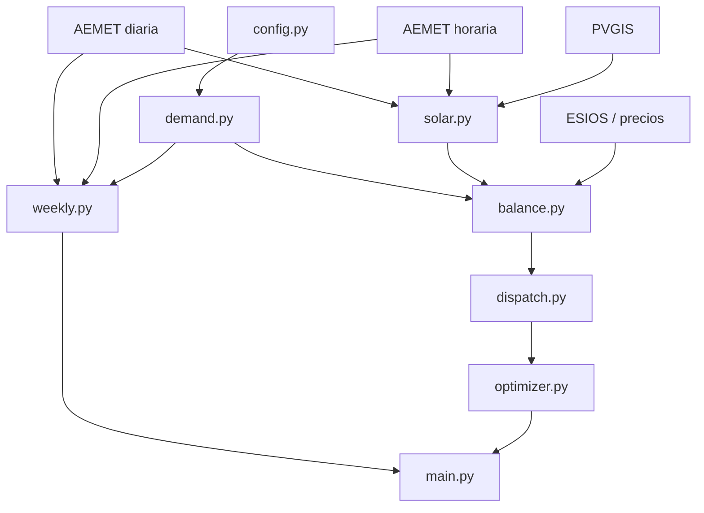
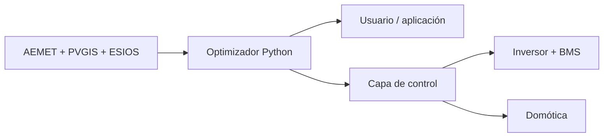

<div align="center">

# ☀️ Gestión Solar Predictiva

### Gestión energética residencial con AEMET, PVGIS y ESIOS

**Predicción fotovoltaica · demanda flexible · batería · precios horarios · planificación semanal**

[](https://www.python.org/)
[](LICENSE)
[](#estado-del-proyecto)
[](docs/ARCHITECTURE.md)

</div>

---

## Qué es

**Gestión Solar Predictiva** es un sistema experimental en Python que convierte previsiones meteorológicas, referencias solares, precios eléctricos y un modelo de demanda doméstica en **decisiones energéticas horarias y semanales**.

El objetivo no es limitarse a estimar cuánta energía producirán los paneles. El sistema intenta responder dos preguntas operativas:

> **¿Qué debe hacer la instalación en cada hora?**  
> Autoconsumir, cargar batería, descargarla, comprar energía o exportar excedentes.
>
> **¿Cuándo conviene prestar cada servicio durante la semana?**  
> Desplazar cargas, climatizar, producir ACS, regar o aprovechar alternativas solares.

Para ello combina datos meteorológicos de **AEMET**, referencias solares de **PVGIS**, precios de **ESIOS**, un modelo físico-predictivo de generación fotovoltaica, demanda flexible y un algoritmo de despacho con criterios energéticos, económicos y de conservación de batería.

La filosofía del sistema no consiste únicamente en minimizar el coste eléctrico diario. También intenta:

- aumentar el autoconsumo;
- desplazar consumos hacia las mejores horas solares;
- preservar la vida útil de la batería;
- evitar ciclos de batería de escaso valor;
- aprovechar almacenamiento térmico;
- anticipar decisiones mediante previsión meteorológica;
- coordinar decisiones diarias con una planificación semanal.

---

## 📚 Documentación técnica

La descripción detallada del modelo, los algoritmos y el procedimiento de validación se mantiene separada del README:

| Documento | Descripción |
|---|---|
| 📐 [**MODEL.md**](docs/MODEL.md) | Modelo físico, energético y matemático |
| 🔋 [**DISPATCH.md**](docs/DISPATCH.md) | Algoritmo de batería, SOC, compra y venta |
| 📅 [**WEEKLY.md**](docs/WEEKLY.md) | Planificación semanal, cargas flexibles y gestión térmica |
| 🧪 [**VALIDATION.md**](docs/VALIDATION.md) | Metodología de validación experimental |
| 🏗️ [**ARCHITECTURE.md**](docs/ARCHITECTURE.md) | Arquitectura software y evolución hacia control real |
| ⚙️ [**INSTALLATION.md**](docs/INSTALLATION.md) | Instalación, APIs, credenciales y puesta en marcha |

---

## Estado del proyecto

El proyecto está en desarrollo y actualmente dispone de:

- predicción meteorológica diaria y horaria;
- modelo físico-predictivo de generación FV;
- perfil horario de demanda doméstica;
- precios horarios de compra y excedentes;
- balance FV–demanda–red;
- despacho horario de batería;
- SOC objetivo predictivo;
- planificación semanal de servicios;
- gestión térmica basada en previsión de temperatura;
- cálculo de autoconsumo, autosuficiencia, compras, ventas y ciclos equivalentes.

La siguiente fase es la **validación experimental con datos reales de la instalación** y el acoplamiento progresivo entre planificación semanal, demanda, despacho y control físico.

---

## Filosofía de operación

La estrategia `sostenible_predictiva` sigue aproximadamente esta jerarquía:

```text
Necesidad doméstica
        ↓
Autoconsumo FV directo
        ↓
Desplazamiento de cargas
        ↓
Almacenamiento térmico
        ↓
Batería, si compensa utilizarla
        ↓
Compra / venta de red
```

Un criterio central del proyecto es:

> **La energía almacenada en la batería no se considera gratuita.**

Una compra pequeña de electricidad puede ser preferible a realizar un ciclo de batería de escaso valor energético o económico.

La lógica detallada se describe en [**DISPATCH.md**](docs/DISPATCH.md).

---

## Instalación de referencia

| Elemento | Configuración |
|---|---:|
| Paneles FV | 10 |
| Potencia instalada | 6.05 kWp |
| Inversor | Deye SUN-6K-SG05LP1-EU-AM2-P |
| Potencia nominal | 6.00 kW |
| Baterías | 2 × SE-G5.1 Pro-B |
| Energía nominal | 10.24 kWh |
| SOC operativo normal | 20–85 % |
| Ventana sostenible | 6.656 kWh |

Estos valores corresponden únicamente a la instalación de referencia. La configuración física y la localización se centralizan en `config.py`.

---

## Flujo de decisión

```text
AEMET + PVGIS + ESIOS
          │
          ▼
 Predicción meteorológica
          │
          ▼
 Modelo físico FV ──────► Perfil de demanda
          │                    │
          └────────┬───────────┘
                   ▼
             Balance horario
                   │
                   ▼
        Despacho batería / red
                   │
          ┌────────┴────────┐
          ▼                 ▼
     Plan diario       Plan semanal
          │                 │
          └────────┬────────┘
                   ▼
        Recomendación operativa
```

La predicción se transforma así en una propuesta de operación reproducible, no únicamente en una estimación de generación.

---

## Arquitectura



El diseño separa adquisición de datos, modelización física, planificación y control para permitir que cada bloque pueda validarse de forma independiente.

Véase [**ARCHITECTURE.md**](docs/ARCHITECTURE.md).

---

## Módulos principales

| Archivo | Responsabilidad |
|---|---|
| `config.py` | instalación, localización y parámetros físicos |
| `demand.py` | vivienda, cargas y perfil de demanda |
| `aemet.py` | previsión meteorológica diaria |
| `aemet_hourly.py` | previsión meteorológica horaria |
| `solar.py` | modelo físico-predictivo FV |
| `esios.py` | precios eléctricos |
| `balance.py` | balance FV–demanda–precios |
| `dispatch.py` | batería, red, compra y venta |
| `optimizer.py` | estrategia sostenible-predictiva |
| `weekly.py` | planificación semanal de servicios |
| `main.py` | integración y presentación |

---

## Fuentes de datos

### AEMET OpenData

AEMET proporciona la predicción meteorológica utilizada para:

- temperatura;
- nubosidad;
- precipitación;
- estado del cielo;
- corrección meteorológica de la producción FV;
- planificación térmica.

El sistema utiliza mayor resolución cerca del presente:

```text
primeras ~48 h  → AEMET horario
resto de semana → AEMET diario
```

### PVGIS

PVGIS proporciona la referencia solar y climatológica empleada para construir el perfil físico esperado de la instalación.

Conceptualmente:


```math
G_{\mathrm{pred}}(t)
=
G_{\mathrm{PVGIS}}(t)\,
F_{\mathrm{met}}(t)
```


donde $F_{\mathrm{met}}$ representa la corrección meteorológica.

### ESIOS

ESIOS proporciona la información económica utilizada para comparar:

- precio de compra;
- compensación de excedentes;
- oportunidad de usar o preservar la batería.

---

## Modelo fotovoltaico

`solar.py` combina referencia solar, geometría, meteorología AEMET, temperatura de célula y límites del inversor.

Una expresión simplificada de la potencia DC es:


```math
P_{\mathrm{DC}}
=
P_{\mathrm{STC}}
\frac{G}{1000}
\left[
1+\gamma(T_{\mathrm{cell}}-25)
\right]
```


La potencia AC queda posteriormente condicionada por rendimiento y límites del inversor.

La salida horaria puede incluir:

```text
Hora   Gref   Fmet   Gpred   Tamb   Tcell   Pac   Fuente
```

La formulación se desarrolla en [**MODEL.md**](docs/MODEL.md).

---

## Balance energético

Para cada hora:


```math
P_{\mathrm{balance}}(t)
=
P_{\mathrm{FV}}(t)
-
P_{\mathrm{demanda}}(t)
```


Si el balance es positivo existe excedente potencial. Si es negativo existe un déficit que deberá cubrirse mediante batería, red o una combinación de ambas.

Se calculan, entre otras magnitudes:

- autoconsumo directo;
- excedente FV;
- déficit;
- energía importada;
- energía exportada;
- coste de compra;
- ingreso por venta;
- ratio de autoconsumo;
- autosuficiencia.

---

## Batería y despacho

`dispatch.py` transforma el balance energético en decisiones operativas.

Para cada hora se consideran:

```text
FV
Demanda
SOC
SOC objetivo
Compra
Venta
Carga de batería
Descarga de batería
Acción
```

El balance debe satisfacer:


```math
P_{\mathrm{FV}}
+
P_{\mathrm{buy}}
+
P_{\mathrm{dis}}
=
P_{\mathrm{load}}
+
P_{\mathrm{ch}}
+
P_{\mathrm{sell}}
```


La batería opera dentro de límites de SOC y la estrategia penaliza el ciclado innecesario.

Véase [**DISPATCH.md**](docs/DISPATCH.md).

---

## Modelo doméstico

La vivienda de referencia representa cinco ocupantes y contempla, entre otras cargas:

- iluminación;
- cocina de inducción;
- horno;
- microondas;
- robot de cocina;
- cafetera;
- termo eléctrico;
- solar térmica para ACS;
- lavadora;
- bombas de calor;
- aire acondicionado de despensa;
- riego automático;
- lámpara UV asociada al consumo de agua;
- cargas eléctricas de base.

También se consideran **hornos solares**, capaces de sustituir parte del consumo eléctrico de cocina cuando las condiciones son favorables.

---

## Planificación semanal

`weekly.py` genera un horizonte de siete días y clasifica los servicios según su naturaleza.

| Tipo | Ejemplos | Criterio principal |
|---|---|---|
| Tarea desplazable | lavadora, horno | presencia + solar + horario |
| Térmica | climatización | temperatura prevista |
| Condicional | termo eléctrico | necesidad real de ACS |
| Restricción externa | riego | criterio físico/agronómico |
| Alternativa solar | horno solar | disponibilidad solar |

La planificación semanal se desarrolla en [**WEEKLY.md**](docs/WEEKLY.md).

---

## Gestión térmica predictiva

La climatización no se trata como una simple tarea desplazable.

En verano, el sistema puede utilizar la temperatura exterior prevista para construir una ventana de funcionamiento:

```text
12:00   28 °C
13:00   29 °C
14:00   31 °C  ← activar
15:00   34 °C
16:00   35 °C
17:00   32 °C
```

Resultado orientativo:

```text
14:00–18:00 | CLIMATIZAR
```

Para horizontes más largos se utilizan las variables meteorológicas diarias disponibles. Una futura versión podrá incorporar temperatura interior e inercia térmica del edificio.

---

## ACS solar

La prioridad conceptual del sistema de agua caliente es:

```text
captación solar térmica
        ↓
bomba de intercambio
        ↓
temperatura del acumulador
        ↓
termo eléctrico solo si es necesario
```

Por tanto, disponer de excedente fotovoltaico no implica automáticamente activar el termo eléctrico.

---

## Instalación y ejecución

Instalar dependencias:

```bash
python3 -m pip install -r requirements.txt
```

Ejecución básica:

```bash
python3 main.py --soc 0.60
```

Ejecución detallada:

```bash
python3 main.py \
    --soc 0.60 \
    --mostrar-semanal \
    --mostrar-precios \
    --mostrar-solar \
    --mostrar-balance \
    --mostrar-plan-horario
```

Planificación semanal independiente:

```bash
python3 weekly.py
```

---

## 🖥️ Ejemplo de salida general

Una ejecución completa muestra de forma secuencial la instalación, la planificación semanal, la meteorología, la producción FV, los precios, el balance energético y el despacho de batería.

Salida abreviada representativa:

```text
======================================================================
GESTIÓN SOLAR PREDICTIVA
======================================================================

Sistema fotovoltaico
--------------------
Paneles               : 10
Potencia FV instalada : 6.05 kWp
Inversor              : Deye SUN-6K-SG05LP1-EU-AM2-P
Potencia inversor     : 6.00 kW
Baterías              : 2 × SE-G5.1 Pro-B
Energía nominal       : 10.24 kWh
SOC normal            : 20–85 %

Plan semanal sostenible de servicios
------------------------------------
Versión                : 4
Estación               : verano
Horizonte              : 7 días

Día         Fecha          Solar    Tmax     Calidad   Confianza
----------------------------------------------------------------
domingo     09/08/2026      0.70      40       bueno        alta
lunes       10/08/2026      0.80      38       bueno        alta
martes      11/08/2026      0.94      39   excelente       media
miércoles   12/08/2026      0.53      40   aceptable       media
jueves      13/08/2026      0.48      39        malo        baja
viernes     14/08/2026      0.50      38   aceptable        baja
sábado      15/08/2026      0.56      37   aceptable        baja

Previsión meteorológica
-----------------------
Municipio             : Maracena
Índice solar          : 0.701
Temperatura máxima    : 40 °C

Generación fotovoltaica prevista
--------------------------------
Energía FV diaria     : 26.08 kWh
Pico FV previsto      : 14:00 — 3.37 kW

Resumen energético sin batería
------------------------------
Demanda total             : 22.50 kWh
Generación FV             : 26.08 kWh
Autoconsumo FV directo    : 18.07 kWh
Excedentes FV             : 8.01 kWh
Déficit cubierto por red  : 4.43 kWh
Ratio de autoconsumo      : 69.3 %
Autosuficiencia directa   : 80.3 %

Resumen del despacho sostenible
-------------------------------
Carga de batería          : 1.63 kWh
Descarga de batería       : 1.95 kWh
Energía ciclada           : 3.58 kWh
Ciclos equivalentes       : 0.175
Compra de red             : 2.48 kWh
Venta a red               : 6.38 kWh
Coste de compra           : 0.378 €
Ingreso por venta         : 0.139 €
Balance económico neto    : 0.239 €
SOC final previsto        : 55.0 %
SOC mínimo previsto       : 40.0 %
SOC máximo previsto       : 57.6 %
```

### Ejemplo de decisiones horarias

La salida detallada permite observar directamente las decisiones del algoritmo:

```text
Hora      FV    Dem    SOC    Red+   Red-   Bat+   Bat-   Acción
---------------------------------------------------------------------------
08:00    0.16   0.61   ...    ...    ...    ...    ...    AUTOCONSUMO
09:00    0.69   0.22   ...    ...    ...    ...    ...    CARGAR_BATERIA
10:00    1.58   0.22   ...    ...    ...    ...    ...    CARGAR + VENDER
12:00    3.11   2.62   ...    ...    ...    ...    ...    AUTOCONSUMO + VENDER
20:00    0.43   1.11   ...    ...    ...    ...    ...    DESCARGAR_BATERIA
22:00    0.00   0.24   ...    ...    ...    ...    ...    COMPRAR / DESCARGAR
```

La salida completa contiene las 24 horas de predicción FV, precios ESIOS, balance energético y decisiones de carga, descarga, compra y venta.

---

## Credenciales

El proyecto necesita claves personales para determinadas APIs.

Actualmente pueden almacenarse localmente en:

```text
mytoken.env
```

por ejemplo:

```text
AEMET_API_KEY=TU_CLAVE_AEMET
ESIOS_API_KEY=TU_CLAVE_ESIOS
```

Este archivo **no debe publicarse**.

Añádelo a `.gitignore`:

```gitignore
mytoken.env
.env
*.env
__pycache__/
*.pyc
```

Nunca publiques claves reales en Git, ni siquiera temporalmente.

---

## Dependencias

Las dependencias externas actuales son mínimas:

```text
requests
python-dotenv
```

Se instalan mediante:

```bash
python3 -m pip install -r requirements.txt
```

---

## 🧪 Validación experimental

La siguiente etapa del proyecto consiste en registrar datos reales de la instalación, por ejemplo:

```text
timestamp
P_FV
P_load
P_grid
P_battery
SOC
temperatura
precio de compra
precio de venta
```

El objetivo es comparar:


```math
\text{predicción}
\quad\text{vs.}\quad
\text{medida real}
```


y evaluar:

- MAE y RMSE de generación FV;
- error energético diario;
- SOC previsto frente a real;
- ahorro económico;
- autoconsumo;
- autosuficiencia;
- ciclos equivalentes de batería;
- utilidad real del desplazamiento de cargas.

El protocolo se describe en [**VALIDATION.md**](docs/VALIDATION.md).

---

## 🚀 Evolución prevista

La arquitectura está pensada para evolucionar hacia un **Home Energy Management System (HEMS)**.



Una futura aplicación podría:

- avisar del mejor momento para poner la lavadora;
- recomendar el uso del horno solar;
- planificar ACS;
- anticipar climatización;
- conservar SOC antes de un día de baja producción;
- modificar consignas del inversor;
- decidir cuándo comprar o exportar energía;
- informar al usuario de las decisiones y de su justificación.

La lógica científica debe permanecer separada de la capa física de control.

---

## Seguridad

Este software es experimental.

No sustituye:

- protecciones eléctricas;
- BMS;
- límites internos del inversor;
- protecciones AC/DC;
- mecanismos de seguridad del fabricante.

Una futura conexión automática con hardware deberá incluir validación independiente de consignas, gestión de errores y un modo seguro de respaldo.

---

## Estructura del repositorio

```text
Gestion-Solar-AEMET-ESIOS/
│
├── main.py
├── config.py
├── demand.py
├── aemet.py
├── aemet_hourly.py
├── solar.py
├── esios.py
├── balance.py
├── dispatch.py
├── optimizer.py
├── weekly.py
│
├── README.md
├── LICENSE
├── requirements.txt
│
└── docs/
    ├── MODEL.md
    ├── DISPATCH.md
    ├── WEEKLY.md
    ├── VALIDATION.md
    └── ARCHITECTURE.md
```

---

## Antes de publicar

Comprueba que no existen credenciales:

```bash
grep -RniE \
    'api[_-]?key|token|password|passwd|secret|authorization' \
    . \
    --exclude-dir=.git
```

Si una clave real fue incluida alguna vez en un commit, eliminarla del archivo actual no es suficiente: debe revocarse o regenerarse.

---

## Licencia

Este proyecto se distribuye bajo la [**MIT License**](LICENSE).

---

## Autor

**Enrique M. Moreno Pérez**

Proyecto experimental de gestión energética residencial, predicción fotovoltaica y optimización sostenible.

---

<div align="center">

### AEMET + PVGIS + ESIOS + demanda flexible + batería

*De la predicción meteorológica a una gestión energética doméstica reproducible.*

</div>
